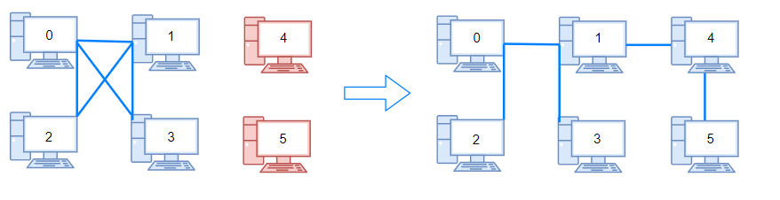

# Number of Operations to Make Network Connected
[Leetcode Link](https://leetcode.com/problems/number-of-operations-to-make-network-connected/)

## Problem:

There are `n` computers numbered from `0` to `n-1` connected by ethernet cables connections forming a network where `connections[i] = [a, b]` represents a connection between computers `a` and `b`. Any computer can reach any other computer directly or indirectly through the network.

Given an initial computer network `connections`. You can extract certain cables between two directly connected computers, and place them between any pair of disconnected computers to make them directly connected. Return the *minimum number* of times you need to do this in order to make all the computers connected. If it's not possible, return -1. 

## Example:


```
Input: n = 4, connections = [[0,1],[0,2],[1,2]]
Output: 1
Explanation: Remove cable between computer 1 and 2 and place between computers 1 and 3.
```

```
Input: n = 6, connections = [[0,1],[0,2],[0,3],[1,2],[1,3]]
Output: 2
```
```
Input: n = 6, connections = [[0,1],[0,2],[0,3],[1,2]]
Output: -1
Explanation: There are not enough cables.
```
```
Input: n = 5, connections = [[0,1],[0,2],[3,4],[2,3]]
Output: 0
```

## Note:
